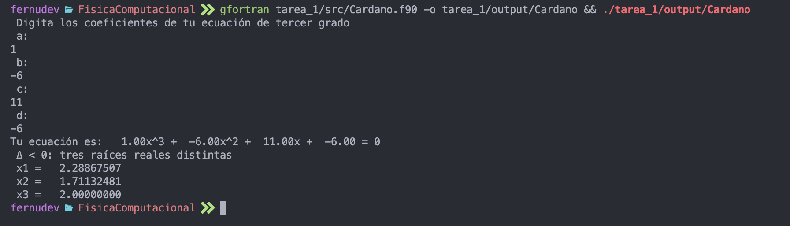

# Tarea 1 Fisica Computacional

_Luis Fernando Nuñez Rangel_

Este repositorio contiene dos programas escritos en Fortran para resolver problemas matemáticos fundamentales:

- [`Cardano.f90`](src/Cardano.f90): Resuelve ecuaciones cúbicas usando la fórmula de Cardano.
- [`vectores.f90`](src/vectores.f90): Realiza operaciones básicas con vectores en Rⁿ, incluyendo suma, resta, norma, producto punto y producto vectorial.

---

## 1. Cardano.f90

### Descripción

Este programa solicita al usuario los coeficientes de una ecuación cúbica de la forma:

```
a x³ + b x² + c x + d = 0
```

Utiliza la fórmula de Cardano para calcular las raíces de la ecuación, considerando los tres posibles casos según el discriminante:

- **Δ > 0:** Una raíz real y dos complejas conjugadas.
- **Δ = 0:** Tres raíces reales, al menos dos iguales.
- **Δ < 0:** Tres raíces reales distintas.

### Uso

1. Compila el programa:
   ```sh
   gfortran src/Cardano.f90 -o cardano
   ```
2. Ejecuta el programa:
   ```sh
   ./cardano
   ```
3. Ingresa los coeficientes `a`, `b`, `c`, `d` cuando se soliciten.

### Salida

El programa muestra la ecuación ingresada y las raíces calculadas, indicando el tipo de raíces según el discriminante.

### Casos de uso

A continuación se exponen 3 ejemplos sobre el uso del programa Cardano.f90

- **Δ > 0:** Una raíz real y dos complejas conjugadas.
 11.19.53 p.m..png>)

- **Δ = 0:** Tres raíces reales, al menos dos iguales.
 11.18.23 p.m..png>)

- **Δ < 0:** Tres raíces reales distintas.

---

## 2. vectores.f90

### Descripción

Este programa permite realizar operaciones con dos vectores de dimensión arbitraria `N`:

- **Norma** de cada vector.
- **Suma** y **resta** de vectores.
- **Norma** de la suma y resta.
- **Producto punto** y cálculo del **ángulo** entre los vectores.
- **Producto vectorial** (solo si N=3).

Incluye una subrutina interna llamada [`norma`](src/vectores.f90) para calcular la norma de un vector.

### Uso

1. Compila el programa:
   ```sh
   gfortran src/vectores.f90 -o vectores
   ```
2. Ejecuta el programa:
   ```sh
   ./vectores
   ```
3. Ingresa la dimensión `N` y las componentes de los dos vectores cuando se solicite.

### Salida

El programa muestra:

- Las normas de ambos vectores.
- Los vectores suma y resta, junto con sus normas.
- El producto punto y el ángulo entre los vectores (en grados).
- El producto vectorial y su norma (solo si N=3).

 11.23.48 p.m..png>)

---

## Estructura de carpetas

```
tarea_1/
├── output/           # (Opcional) Carpeta para archivos de salida
├── src/
│   ├── Cardano.f90   # Programa para ecuaciones cúbicas
│   └── vectores.f90  # Programa para operaciones con vectores
└── README.md         # Este archivo
```

---

## Requisitos

- Compilador Fortran (por ejemplo, `gfortran`)

---